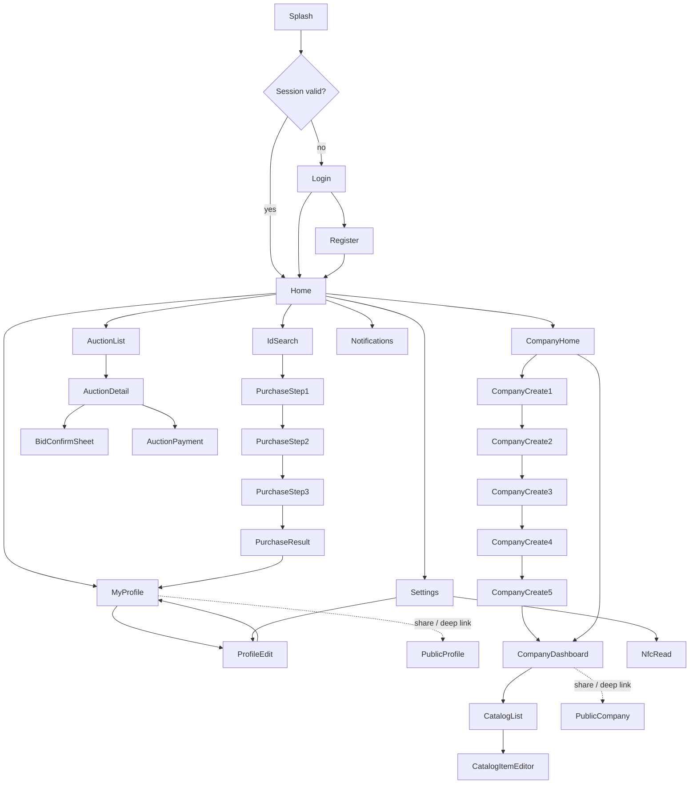

# PHASE 4 — Screen Map & Navigation Graph

Scoped strictly to the brief's 9 core sections (§3 of the brief) — no extra sections
added, per "keraksiz bo'limlar qo'shilmasin." Legacy web-only features not in this list
(messaging, lead capture, card designer, gifts, news feed, ranking, admin) are **not**
built for Android v1; they can be revisited later without re-architecting anything
here since the API client (Phase 3) is organized by domain, not by screen.

## 4.1 Full screen inventory

| # | Screen | Section | Key API calls | Notes |
|---|--------|---------|----------------|-------|
| 1 | Splash | — | `GET /api/auth/me` | Brand mark + gold shimmer, resolves session before routing |
| 2 | Login | 1 | `POST /api/auth/login` | |
| 3 | Register | 1 | `POST /api/auth/request-register-code`, `POST /api/auth/register` | Ships fully built; CTA gated behind a remote flag until backend confirms it's live (Phase 1 §1.6) |
| 4 | Home | 2 | `GET /api/auth/me`, `GET /api/records` (mine), `GET /api/auctions`, `GET /api/companies/mine` | Dashboard — mockup screen 3 |
| 5 | ID Search / Catalog | 3 | `GET /api/records`, `GET /api/records/search` | Mockup screen 4 |
| 6 | ID Purchase — Step 1 (select) | 3 | (uses search result) | |
| 7 | ID Purchase — Step 2 (confirm/profile form) | 3 | `src/lib/pricing.ts` preview only | |
| 8 | ID Purchase — Step 3 (payment) | 3 | `POST /api/records/:code`, `GET /api/settings/payments-enabled` | Mockup screen 9 |
| 9 | Purchase Result | 3 | `GET /api/orders/:id` (poll) | Mockup screen 10 |
| 10 | Auction List (tabs: Live/Yaqinda/Tugagan/Men qatnashgan) | 4 | `GET /api/auctions?withSold=1`, `GET /api/auction-demand` | Mockup screen 5 |
| 11 | Auction Detail | 4 | `GET /api/auctions/:id` (poll 4s), `POST /api/auctions/:id/bid` | |
| 12 | Bid Confirm Sheet | 4 | (part of #11) | |
| 13 | Auction Payment | 4 | `POST /api/auctions/:id/pay`, `GET /api/orders` | |
| 14 | My Profile (NFC Profile View, own) | 5,7 | `GET /api/records/:code`, `GET /api/follow-stats/:code` | Mockup screens 6 & 10 combined concept — owner sees edit affordances |
| 15 | Profile Edit | 5 | `PUT /api/records/:code`, `POST /api/upload`, `POST /api/upload-audio` | Mockup screen 7, with Live Preview panel |
| 16 | Public NFC Profile View (others', + deep link target) | 7 | `GET /api/records/:code`, `POST /api/records/:code/view`, `POST/DELETE /api/follow/:code` | Mockup screen 6 — the "most premium" screen per brief §10 |
| 17 | Company Home (list mine / create CTA) | 6 | `GET /api/companies/mine` | |
| 18 | Company Create — Step 1 (ID) | 6 | `GET /api/companies/check` | Mockup screen 8, step 1 |
| 19 | Company Create — Step 2 (info) | 6 | (local form state) | Mockup screen 8, step 2 |
| 20 | Company Create — Step 3 (logo/cover) | 6 | `POST /api/upload` | Mockup screen 8, step 3 |
| 21 | Company Create — Step 4 (preview) | 6 | — | |
| 22 | Company Create — Step 5 (submit) | 6 | `POST /api/companies` | |
| 23 | Company Dashboard | 6 | `GET /api/companies/:id`, `POST .../submit`, `POST .../payment` | |
| 24 | Company Catalog List (Mahsulot/Xizmat/Menyu — whichever module applies) | 6 | `GET /api/companies/:id` | Single module per company, per `businessModule()` |
| 25 | Catalog Item Editor (bottom sheet) | 6 | `POST/PATCH/DELETE .../catalog(/:itemId)` | |
| 26 | Public Company Profile (deep link target `/c/:id`, `/company/:id`) | 6 | `GET /api/companies/:id` | |
| 27 | Notifications | 8 | `GET /api/gift-offers`, `GET /api/auctions/won/pending` | No push backend — client aggregation (Phase 1 §1.6 item 4) |
| 28 | Settings | 9 | `POST /api/auth/logout` | Sub-screens: Profil ma'lumotlari (→ #15), Xavfsizlik, Til, Bildirishnomalar (notif preferences, local-only), Yordam, Ilova haqida |
| 29 | NFC Read ("NFC o'qish") | 9 | `GET /api/tap/:chipToken` | Mockup screen 14 — foreground NFC dispatch |

29 screens total for a "juda mukammal" but *not* feature-creeping build of exactly the
9 requested sections — several are steps within one wizard flow rather than
independent destinations.

## 4.2 Navigation graph

## 4.3 Bottom tab bar (brief §14 — hard cap of 5)

`Bosh sahifa` (Home) · `ID` (Id Search/Catalog) · `Auksion` · `Kompaniya` · `Profil`
(My Profile, with Notifications/Settings reachable from its header icons and from the
PremiumHeader on Home — not separate tabs). Active = gold (`#D7B65D`), inactive =
`#A5A5A5`, per the design system.

## 4.4 Screen → design-system component mapping (sanity check before Phase 5)

Every screen above is buildable purely from the component list in Phase 5
(PremiumButton/Card/Input/Sheet/Modal/Badge/Header/Tab/ListRow/StatCard/EmptyState/
LoadingSkeleton/Toast) plus 3 screen-specific composites: `AuctionCountdown`,
`MusicPlayer` (YouTube/Yandex/file), and `NfcCardVisual` (the circular gold-ring
avatar centerpiece). No screen requires a bespoke one-off component outside that set,
which keeps the design system honestly reusable rather than a pile of per-screen
snowflakes.
